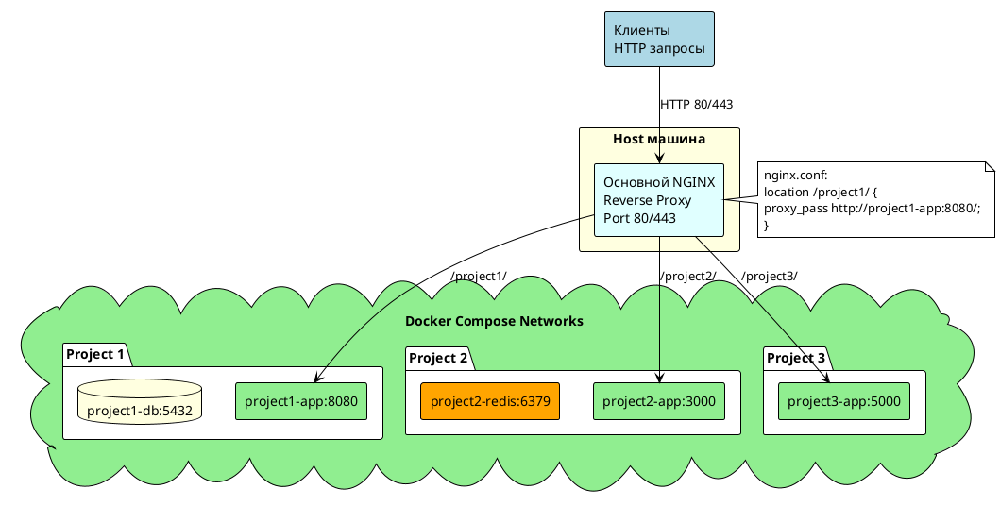

# Infrastructure Docker

Приложение для единой точки деплоя приложения tourismania

## Пользователи и группы системы

`пользователь_разработчик` - для прямого подключения по ssh

`пользователь_гитхаб` - для реализации CD

`группа_для_работы_с_приложением_tourismania` - для возможности обновления файлов на сервере в папке приложения. Состоит из: `пользователь_разработчик`,
`пользователь_гитхаб`

## Архитектура

### Конфигурация NGINX

1. Все запросы на сервер (хост-машину) поступают на основной nginx.
2. Далее основной nginx распределяет запросы между проектами (docker compose)




Пример конфига основного nginx
```nginx configuration
server {
    listen 80;
    server_name *;
    return 301 https://$host$request_uri;
}

server {
        listen 443 ssl;
        server_name *;

        ssl_certificate 'path_to_ssl.cer';
        ssl_certificate_key 'path_to_ssl.key';

        location / {

                proxy_set_header Host $host;
                proxy_set_header X-Real-IP $remote_addr;
                proxy_set_header X-Forwarded-For $proxy_add_x_forwarded_for;
                proxy_set_header X-Forwarded-Proto $scheme;
                proxy_set_header X-NginX-Proxy true;
                proxy_set_header Upgrade $http_upgrade;
                proxy_set_header Connection "upgrade";

                proxy_pass http://ip_address_docker_container:port; # IP-адрес контейнера Docker
        }
}


```

### Конфигурация Docker

Контейнеру с nginx выдается статический IP, чтобы можно было достучаться из nginx на хосте

```yaml
version: "3.9"

services:
  nginx:
    image: nginx:latest
    container_name: nginx_container
    networks:
      custom_network:
        ipv4_address: 'ip_address_docker_container'
    volumes:
      - ./nginx_container.conf:/etc/nginx/conf.d/default.conf
    ports:
      - "8080:8080"

networks:
  custom_network:
    driver: bridge
    ipam:
      config:
        - subnet: 192.168.100.0/24
```

